# Gene naming: the decision tree

How `assign_gene_names_v2.pl` (branch `naming-v2`) names one gene, in the order the code tries
the steps (`decide_name`, with the checks `choose_closest_human` makes on OMA's set before it). The
first box that gives a name names the gene. Every step uses a name only if it is informative
(GENE_NAMING_METHODS.md §4). The full rules, thresholds and examples are in GENE_NAMING_METHODS.md;
this page is the map. Keep it in step with the code. A rendered copy for viewers without Mermaid:
[naming_decision_tree.svg](naming_decision_tree.svg) (regenerate with

```mermaid
flowchart TD
    start([A gene: all its isoforms pooled]) --> curated{"1 · Named by a curator?"}
    curated -- yes --> nCurated["Curator's name<br/><b>TAS</b> · Curated"]
    curated -- no --> source{"2 · The gene set's own name (RefSeq / Ensembl),<br/>or a naming species: its OMA 1:1 / many:1 ortholog,<br/>else a full-length reciprocal best hit,<br/>else (another species only) a full-length best hit?"}
    source -- yes --> nSource["Its name; another species' name ends '-like (label)'<br/><b>SRC</b> / <b>ISO</b> / <b>ISS</b>"]
    source -- no --> teFamily{"Transposable-element domain AND<br/>OMA pairs ≥ 5 copies here with one human gene?"}
    teFamily -- "yes: a transposon family" --> nTE["'&lt;class&gt; transposase domain-containing protein'<br/><b>ISM · te</b>"]
    teFamily -- no --> oma{"3 · OMA human ortholog?<br/>pairwise (tier 1) or HOG (tier 2)"}

    oma -- yes --> omaSet["Prepare OMA's set<br/>· readthroughs and other Ensembl models of one gene not counted<br/>· pairwise 1 gene but HOG several → the HOG's family"]
    omaSet --> supported{"Supported? a hit to one of the human genes<br/>(any coverage) or a shared PANTHER family"}
    supported -- "no → omaX" --> te
    supported -- yes --> against{"Evidence against it?<br/>· best hit another gene AND PANTHER family differs → omaC<br/>· ≥ 5 copies paired, fewer than half pass → omaR<br/>· this gene spans both halves of a readthrough (fused model?)"}
    against -- yes --> againstFamily{"OMA's set several human genes?"}
    againstFamily -- "yes: a family" --> teSkip
    againstFamily -- "no: one gene" --> te
    against -- no --> oneGene{"One human gene?"}
    oneGene -- yes --> nOrtholog["'SYMBOL: approved name'<br/>'(1 of N)' when N copies here carry it<br/><b>ISO · 1to1 / Nto1</b>"]
    oneGene -- "no: co-orthologs" --> hgncGroup{"Shared HGNC group that is a family by descent?<br/>(PANTHER coherence ≥ 0.6)"}
    hgncGroup -- yes --> nGroup["'&lt;HGNC group&gt; family member' · no symbol<br/><b>ISO · fam</b>"]
    hgncGroup -- no --> pantherShared{"Shared PANTHER family, and the gene a whole member?<br/>(≥ 50% of the model, or a full-length hit to a member)"}
    pantherShared -- yes --> nOmaFamily["'&lt;PANTHER family&gt; family member'<br/><b>ISO · fam</b>"]
    pantherShared -- "no: family unnamed" --> teSkip{"Transposable-element domain?"}
    teSkip -- yes --> nTE
    teSkip -- "no: skip 5 and 6 — both would pick one copy" --> panther

    oma -- no --> te{"4 · Transposable-element domain?"}
    te -- yes --> nTE
    te -- no --> tree{"5 · PANTHER tree: a trusted placement with exactly one human<br/>ortholog, which is also the closest human gene by similarity<br/>(RBH, via another species, or best hit — one gene, not a family)?"}
    tree -- yes --> nTree["'SYMBOL: approved name'<br/><b>ISO · tree</b>"]
    tree -- no --> fullLength{"6 · Best human hit full-length?<br/>(E ≤ 1e-10, ≥ 80% of both proteins; the top hit only)"}
    fullLength -- yes --> tie{"Another human gene within 5% of its bitscore?"}
    tie -- no --> nLike["'SYMBOL-like: name-like'<br/><b>ISS · rbh / bh</b>"]
    tie -- yes --> tieResolve{"Exactly one tied gene a full-length<br/>reciprocal best hit?"}
    tieResolve -- yes --> nLike
    tieResolve -- no --> tieGroup{"Shared HGNC group (family by descent)<br/>or PANTHER family?"}
    tieGroup -- yes --> nTieGroup["'&lt;group or family&gt; family member'<br/><b>ISS · tie-grp</b>"]
    tieGroup -- no --> panther
    fullLength -- no --> panther

    panther{"7 · PANTHER family covering ≥ 75% of its model?<br/>(≥ 80% by protein residues when there is no InterProScan JSON)"}
    panther -- yes --> repeats{"≥ 25% of the match repeat units?"}
    repeats -- yes --> nRepeat["'&lt;repeat&gt;-containing protein'<br/><b>ISM · rpt</b>"]
    repeats -- no --> nPanther["'&lt;family&gt; family member'<br/>InterPro's name, or PANTHER's when InterPro's describes a function<br/><b>ISM · pthr</b>"]
    panther -- no --> domain{"8 · InterPro Domain or Repeat (not DUF / UPF / uncharacterised),<br/>covering ≥ 50% of its model where known?"}
    domain -- yes --> nDomain["'&lt;domain&gt; domain-containing protein'<br/><b>ISM · ipr</b>"]
    domain -- no --> hits{"Any homology evidence at all?"}
    hits -- no --> nNoHits["None: no hits"]
    hits -- yes --> nNotPassed["None: hits did not pass the naming tests"]

    classDef named fill:#e8f4ea,stroke:#3a7d44,color:#1b3a20;
    classDef none fill:#f4e8e8,stroke:#8a3b3b,color:#3a1b1b;
    class nCurated,nSource,nTE,nOrtholog,nGroup,nOmaFamily,nTree,nLike,nTieGroup,nRepeat,nPanther,nDomain named;
    class nNoHits,nNotPassed none;
```

`npx @mermaid-js/mermaid-cli -i <the mermaid block> -o naming_decision_tree.svg -b white`).

## After the name is chosen

1. **Marks added to the tag** (one meaning each: `+` agrees, `~` partly, `C` contradicts, `-` no
   evidence, `X` excluded, `R` rejected): `sim+/~/-` (is the named human gene the best human hit?),
   `pthr+/C` (same PANTHER family?), `tree+/C` (does a trusted PANTHER placement agree?), `hog`
   (OMA's HOG agrees), `te` (the ortholog carries a transposon domain), and, on a name given after
   OMA was not used, `omaX` (set aside), `omaC` (withheld) or `omaR` (pairing mostly rejected).
2. **The relationship** opens the provenance: ortholog, co-ortholog, homolog ("orthology not shown
   (may be a paralog)"), family homolog, domain homolog, curated, source annotation (decision table
   `Relationship`). There is no confidence word (dropped 2026-09-30: it mixed a name's specificity
   with its support).
3. **The provenance** says why, in words: the support, the alignment coverage of both proteins, the
   copies carrying the same name, anything not counted, and every doubt as a caution. The same
   findings, one sentence per type, are the gene statements (Methods 5.3).

## Where the human genes come from (closest human gene, strongest first)

| Tier | Evidence | Reported as |
|---|---|---|
| 1 | OMA pairwise ortholog | the gene; several → their family |
| 2 | OMA HOG co-ortholog | the gene; several → their family |
| 3 | MMseqs2 reciprocal best hit to human | one gene |
| 4 | through another species' ortholog (OMA chain, or RBH + Ensembl Compara) | every human gene the best chain reaches; several → their family |
| 5 | DIAMOND best hit to human | one gene |
| 6 | Swiss-Prot hit in another species → Ensembl Compara | every human gene the chain reaches |
| 7 | Swiss-Prot hit → its PANTHER subfamily | the family |

In every tier, a human readthrough is not a gene of its own, and an Ensembl model with no HGNC
record that overlaps an HGNC gene and shares its sequence is that gene (§3.1 of the Methods).
